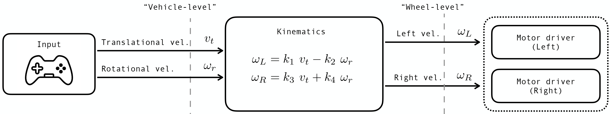

# Simple Mobile Robot

This workspace targets ROS 2 Jazzy and demonstrates how joystick input flows all the way to a motor controller on a differential-drive robot. Each package has its own `README` with more detail for beginners:

- `teleop_core` – joystick to velocity commands ([see README](src/teleop_core/README.md)).
- `kinematic_core` – body velocities to wheel speeds ([see README](src/kinematic_core/README.md)).
- `roboteq_core` – wheel speeds to Roboteq serial commands & battery monitoring ([see README](src/roboteq_core/README.md)).
- `virtual_joypad` – PyQt6 GUI-based virtual controllers for development & testing ([see README](src/virtual_joypad/README.md)).
- `robot_launch` – modular launch system with per-node toggles ([see README](src/robot_launch/README.md)).
- `sim_robot` – simulated robot that integrates wheel velocities into 2-D pose ([see README](src/sim_robot/README.md)).
- `robot_description` – URDF model, mesh, and RViz config for the rover ([see README](src/robot_description/README.md)).

If you are new to ROS 2, start by skimming the package READMEs in order; they explain what each node does and how the messages flow between them.



## Quick Start

1. Install ROS 2 Jazzy (Desktop) and source your setup file:
   ```bash
   source /opt/ros/jazzy/setup.bash
   ```
2. In a new terminal, clone this repository and build the packages:
   ```bash
   colcon build --packages-select teleop_core kinematic_core roboteq_core virtual_joypad robot_launch sim_robot robot_description
   ```
   Optionally add `--symlink-install` during development to mirror files into the install space without rebuilding after every code edit; you can omit it for production setups.
3. After the build finishes, source the workspace so ROS 2 can find the new executables:
   ```bash
   source install/setup.bash
   ```
4. Launch the simulation (virtual joystick + RViz2 + all nodes):
   ```bash
   ros2 launch robot_launch sim.launch.py
   ```
   Or launch the real-robot stack:
   ```bash
   ros2 launch robot_launch actual.launch.py
   ```

## Package Overview

### teleop_core
- Executable: `teleop_node`
- Subscribes to: `joy`
- Publishes: `cmd_vel`, `enable`

### kinematic_core
- Executables: `kinematic_node` (diff), `omni_kinematic_node` (omni/mecanum)
- Subscribes to: `cmd_vel`
- Publishes: `wheel_vel`
- Select model via `kinematic_type:=diff` (default) or `kinematic_type:=omni` at launch.

### roboteq_core
- Executable: `roboteq_node`
- Subscribes to: `wheel_vel`
- Publishes: `battery_state`
- Streams wheel commands over serial to a Roboteq controller.
- Monitors battery voltage at 1 Hz and publishes `sensor_msgs/msg/BatteryState`.

### virtual_joypad
- Executables: `virtual_controller`, `virtual_joy`, `virtual_joy_slider`
- Publishes: `joy`, `enable` (and others)
- Provides a PyQt6 GUI-based virtual operation environment without requiring physical joystick hardware.

### sim_robot
- Executable: `sim_robot_node`
- Subscribes to: `wheel_vel`
- Publishes: `joint_states`
- Applies inverse kinematics to recover v and omega from wheel velocities, integrates 2-D pose, and publishes joint states for `robot_state_publisher`.

### robot_description
- URDF/Xacro model with prismatic x, y and revolute theta joints
- STL mesh for RViz2 visualisation (`rover_cad.stl` for diff, `omni_cad.stl` for omni — switched automatically via `kinematic_type`)
- Launch files for `robot_state_publisher` and RViz2

### robot_launch
- Launch: `bringup.launch.py` (base), `sim.launch.py` (simulation), `actual.launch.py` (hardware)
- Each node can be toggled on/off via launch arguments.
- All nodes run under a `/{robot_id}/` namespace (default: `r1`).
- Robot-specific parameters live in `config/{robot_id}.yaml`.

**Note:** All topic names listed above are relative. At runtime they are prefixed with `/{robot_id}/` (e.g. `/r1/cmd_vel`) by the launch namespace.

## Development Notes

- Launch files are installed via each package's `setup.py`.
- Adjust joystick axis and button mappings in `teleop_core/teleop_core/run_joy.py` if your controller differs.
